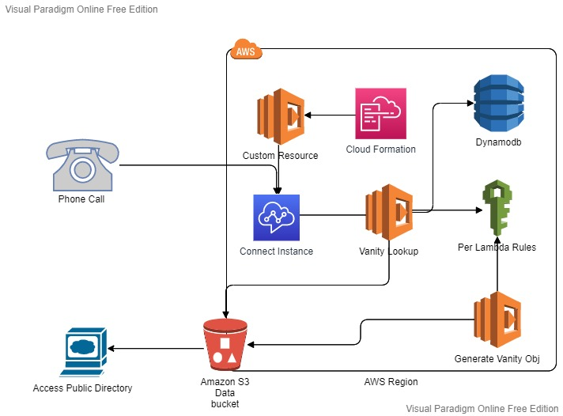

# Phone number to Vanity number
This Serverless Stack, reads the phone number of the calling phone number and generates a vanity number and speaks the generated vanity number of the calling phone number.

## What is a vanity number?
A vanity number is a custom phone number that you can construct to spell out a word, phrase, or business name. Some of the examples are: 
- 1-800-PLUMBER
- 888-PET-FOOD
- 843-TAX-TIPS

For more info ref [this](https://voipstudio.com/blog/what-is-a-vanity-number-and-why-you-should-buy-one/#:~:text=A%20vanity%20number%20is%20a,such%20as%20999%20or%201234.) article 

## Architecture Diagram

## Logic behind the conversion

1. First, *generateVanityObj* lambda restructures all the words in the English dictionary in a way it is easier to lookup up the vanity words for a phone number. filter out words that are more than 10 character long words (as phone numbers are maxed 10 numbers long, excluding the country extension, this limit might break things when the phone numbers are longer than 10).

2. This restructured dictionary object will contain a phone number substring for the corresponding words, making it faster to look up the word in a smaller space than the entire dictionary. (refer to the vanity.json file in the bucket after running the `generateVanityObj.js`)

3. This is a *generate once and use forever* strategy. Hence the `vanity.json` can be generated in build time or every time a word is either added or deleted from the dictionary. Though for the implementation of this code, this function needs to be run manually first.

4. The generated array of words for a corresponding phone number substring is sorted in the order of the frequency (dataset 2) of the words. This is used to determine the **best vanity** among all the possible vanity numbers. The more the frequency of words, the easier it will be to remember the words.

5. Second *vanityLookup* lambda loops over the `vanity.json` for every phone number passed. Then returns an object grouped by its word length sorted in the order of high-frequency words. Once Top X vanity is found, it then pushes the phone number and found vanity numbers in dynamodb and updates the `lastcaller.json` for the last 5 phone numbers.  

6. Top X vanity is simply the most frequent **Longest** word found in the generated dictionary (`vanity.json`). Longer the word, the lesser the numbers to remember.

7. `public` folder in the s3 bucket is used to display the last 5 calls and vanity numbers on the web page.

## Datasets used

1. Words in the English dictionary. A text file containing over 466k English words. [Source](https://github.com/dwyl/english-words/blob/master/words_dictionary.json)
2. Frequency of words. Contains 1/3 Million records derived from the Google Web Trillion Word Corpus [Source](https://www.kaggle.com/rtatman/english-word-frequency). This Dataset is used to find the Top X vanity numbers.

## Dictionary Generation Limitation

1. If there are no words found in the frequency dataset, then the frequency is set to zero, which means if a potentially frequent word is not present in the `unigram_freq.csv` then it will be pushed to the last in the ordered vanity words array for a number sequence. This will affect in choosing the best vanity word.

## Lookup Limitations

1. Only one-word match per phone number.
2. Limited on the words in the dictionary.
3. Limited on the words and the accuracy in the frequently used words dataset.
4. If words that are not present in the frequency dataset will get pushed to last.

## Challenges faced and shortcuts used

1. Getting the S3 bucket arn in the serverless stack was giving an error. Hence a shortcut was used to directly pass the bucket name and arn in the `secrets.yml` file.
2. Attaching Bucket Policy for the S3 Bucket in deploy-time was also consuming time. This was done to make the public folder in the bucket accessable to the world.
3. Shortcut: `GenerateVanityObj.js` attaches the required S3 Bucket Policies to make the public folder accessible to the world. This way of attaching Bucket Policies will be avoided in production as this will either be done internally within CloudFormation or the custom resource lambda will handle this job. Perhaps, the whole `GenerateVanityObj.js` can be repurposed to custom resource lambda trigger.
4. Populating the Data Bucket needs to be done manually. this was done to redude the build size (and inturn time to deploy) for every deploy during the development.
5. AWS wouldn't let me claim phone numbers for my Amazon Connect instances. Had to reach out the customer support. Shortcut: Created a fresh AWS Account.
6. Code Reuse not enforced fully, `readObjBucket()` and `writeObjBucket()` functions are duplicated in both the lambdas, this would cause issues in maintaining these functions. OOP can be used to solve this with more time.
7. Custom Resources lambda implementation was bit tricky to debug as the stack would go to unreachable state when there were any error in the CloudFormation response.
8. Any errors in the custom resource lambda would trigger roll back during stack creating. This would delete the custom resource lambda. This means even the CloudWatch Log groups would get deleted make it even more difficult to debug. Shortcut: logs were pushed to S3 bucket. Bad idea, but worked.

## Future work

1. Process the word frequency to include every word in the dictionary
2. Clean the dictionary dataset. To exclude censored/unwanted words if any.
3. Production environment will have all the saved .json data stored in the database.
4. Implement custom resource lambda trigger, which would populate the s3 Bucket with necessary data, set s3 bucket permissions, and generate `vanity.json`
5. Implement test automation scripts. (ran out of time)
6. BathchWrite to dynamodb can be implemented, currently, when an array of numbers are passed to lambda, dynamodb call is made for every number. Similarly S3 calls can also be reduced to maintain `lastcaller.json`
7. Error Handling can be improved with intensive logs and alerts. Additionally, StepFunctions can also be used.

## Misc

1. [Serverless Framework](serverless.com) was used for development in this project. This uses AWS CloudFormation, and builds templates very similar to AWS SAM. As I have more experience with this framework, it was used to increase development speed.

## Known loopholes

1. Its not safe to display the phone number of last 5 callers out to the world for privacy reasons.
2. Lambdas have s3:* access, which can be used to exploit the system. This was a short cut used, to speed up development process.
3. Potential SQL injection-like attacks when invoking the lambda manually. Solution, Serialize and avoid manual invocation of lambda.
4. Though effort were made to have separate IAM roles for each lambda. But there may be potential misconfiguration of these permissions which could also lead to attacks.

## Steps to deploy in a new environment

1. install serverless framework. `npm install -g serverless` [for more info](https://www.serverless.com/framework/docs/getting-started)
2. setup aws cli profile and update it in the serverless.yml file.
3. run `npm install` from the root of this directory
created by the name *parrot-beak-dev-assets-xxxxxxxxxxxxx*
4. go to `secrets.yml` and add your [connect instance id](https://aws.amazon.com/premiumsupport/knowledge-center/find-connect-instance-id/) in `CONNECT_INSTANCE_ID` attribute.
5. run `serverless deploy --staging dev` from the root of this directory
6. run `aws s3 ls --profile your-profile`. Once the deploy is complete, you should be able to see a bucket created by the name parrot-beak-dev-assets-xxxxxxxxxxxxx keep this handy, you will need it again.
7. copy files to the bucket `aws s3 sync ./bucket s3://bucket-name --profile your-profile`
8. invoke the *GenerateVanityObj* lambda `aws lambda invoke --function-name parrot-beak-dev-GenerateVanityObj --profile your-profile ./invoke.txt`
9. go to your Amazon Connect instance and claim phone number. You should now be able to choose `Vanity-ContactFlow` from the contact flow drop down.
10. You can now make calls on the number to get vanity number. You can now visit <https://{bucket-name}.s3.{region}.amazonaws.com/public/index.html> to view the last 5 callers.

## For Assessor

1. Use +44 1616053574 (+44 16160-kelp-4, proudly generated by this code 😎) (UK number) to test the contact flow in my environment
2. Navigate to [this](https://parrot-beak-dev-assets-428ihlbjwo51.s3.eu-west-2.amazonaws.com/public/index.html) link to view the web page of last 5 caller.
3. Deployment automation needs to be bit more contained. This could be as part of Custom resource implementation. Ran out of time. Use the steps documented above to deploy in other aws env.
